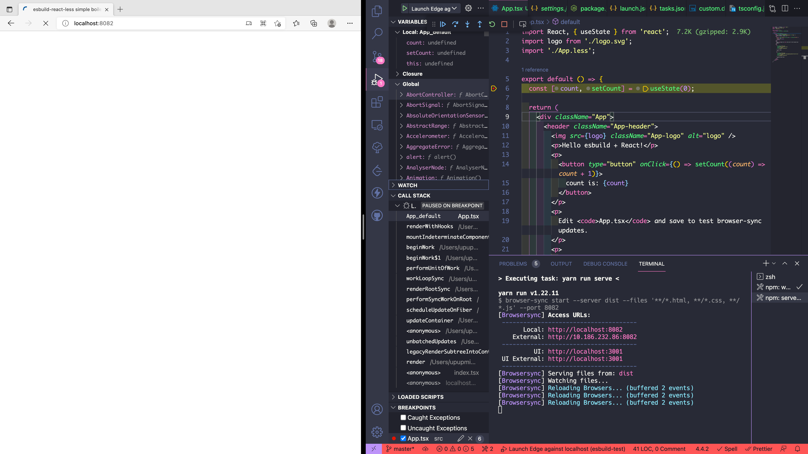

# esbuild-react-less

A super simple and fast template using esbuild to build a single page React app with support for Less. Thanks to esbuild, it takes only ~100ms to build the project.

## Motivation

I am going to develop some [webview page for VSCode plugin](https://code.visualstudio.com/api/extension-guides/webview). Since VSCode will download all the dist files on plugin installation, server-side rendering, code-splitting are all not necessary. Next.js is too complicated to setup and the `next export` command is too slow (Next.js is not designed for this, see https://github.com/vercel/next.js/issues/11360). The reason why I don't use Umi.js/create-react-app/Vite is the same, which is to keep the output bundle as simple as possible and the build time as fast as possible (Vite uses Rollup for build too, and Rollup takes around ~30secs to build a simple React counter App).

## Development

Develop in the watch mode:

```bash
yarn watch
```

Open an browser-sync http server at the same time to see the web page on browser:

```bash
yarn serve
```

## Debug

Just press <kbd>F5</kbd> and add breakpoints in the source code, you will get the following results:



## References

1. https://github.com/vitejs/vite/tree/main/packages/create-vite/template-react-ts
